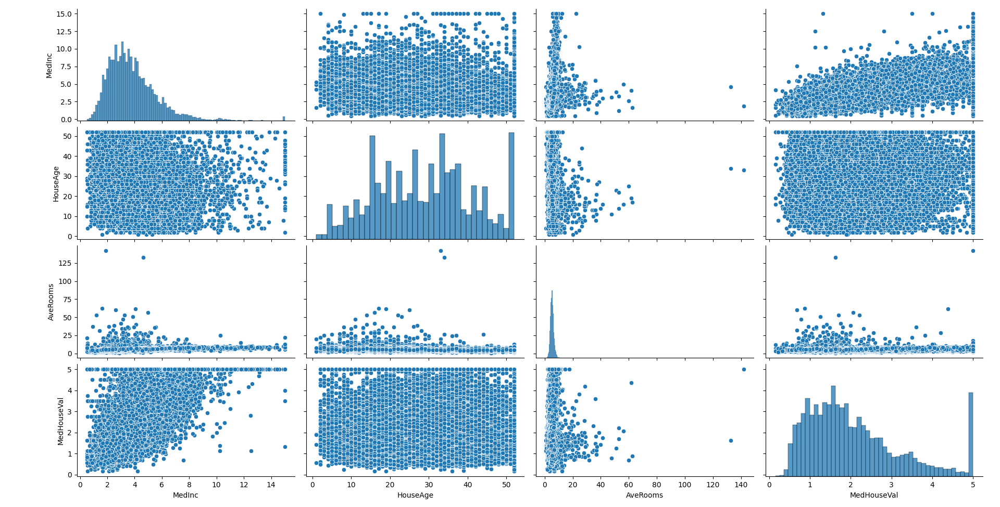

```markdown
# 🏠 House Price Prediction

This project utilizes machine learning techniques to predict house prices based on various features such as the number of rooms, size, location, and more.

## 📁 Project Structure

```
house-price-prediction/
│
├── data/                  ← Dataset files
├── models/                ← Trained machine learning models
├── notebooks/             ← Jupyter notebooks for exploration and experimentation
├── app.py                 ← Main application script (if applicable)
├── requirements.txt       ← Required Python packages
└── .gitignore             ← Files and directories excluded from Git tracking
```

## ⚙️ Requirements

- Python 3.10 or higher
- All required packages are listed in `requirements.txt`

To install them:

```bash
pip install -r requirements.txt
```

## 🚀 How to Run

```bash
python app.py
```

(Make sure your virtual environment is activated before running the script)

## 🧠 Technologies Used

- Python 🐍
- Pandas & NumPy
- Scikit-learn
- Matplotlib / Seaborn

## 🎯 Project Objective

The goal of this project is to build an accurate predictive model that can estimate the price of a house given specific input features. This can help users make informed real estate decisions.
 --------------------------------------------------------------------------------

📊 Model Results
Several machine learning models were evaluated to predict house prices based on features such as median income, house age, average number of rooms, population, and more. The performance of each model was assessed using the following metrics: Mean Squared Error (MSE), Mean Absolute Error (MAE), and R² score.

🔹 Linear Regression
MSE: 0.556

MAE: 0.533

R² Score: 0.576

🌳 Decision Tree Regressor
MSE: 0.488

MAE: 0.451

R² Score: 0.627

🌲 Random Forest Regressor
MSE: 0.254

MAE: 0.328

R² Score: 0.806

📈 Support Vector Regression (SVR)
MSE: 0.355

MAE: 0.398

R² Score: 0.729

✅ Conclusion: The Random Forest Regressor performed the best among all tested models, achieving the highest R² score and the lowest error values.

## 📊 Exploratory Data Analysis (EDA)

We used pairplot to visualize relationships between numerical features in the dataset.  
The following plot helps in identifying linear relationships and feature distributions:




